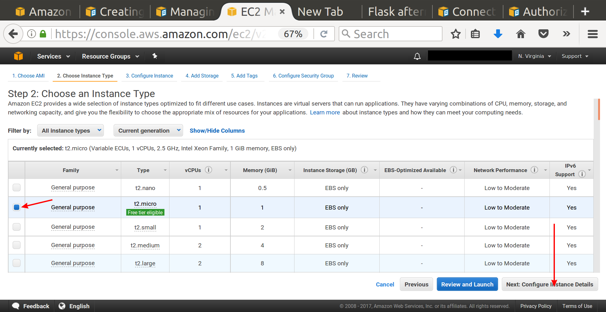
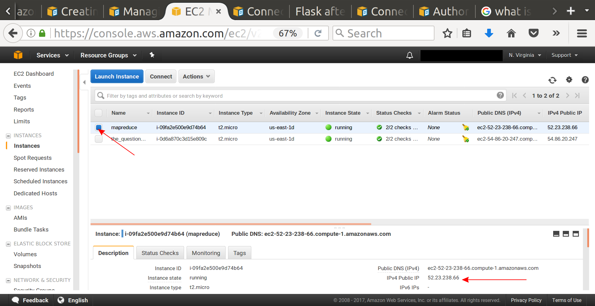

# Introduction to MapReduce, mrjob, and Amazon EMR

This morning we will be covering Map Reduce using [mrjob.](https://pythonhosted.org/mrjob/)  First, we'll use `mrjob` to count words in a corpus locally.  Then, you'll do the same analysis in the cloud.  The purpose of doing the same analysis on the cloud that you do locally is to ensure that your cloud implementation works.  Once it is, you can extrapolate to bigger datasets with confidence.  

AWS is a command line environment, so this assignment also has you practice with some command line tools: `tar, mkdir, cp, *, less, sort, >, ssh, scp`.

## Meet mrjob

`mrjob` is a Python package that helps you write and run [Hadoop Streaming](https://www.tutorialspoint.com/hadoop/hadoop_streaming.htm) jobs. It supports Amazon's Elastic MapReduce (EMR) and it also works with your own Hadoop cluster.  It has been released as an open-source framework by Yelp and we will use it to interface with Hadoop due to its legibility and ease of use with MapReduce tasks.  Feel free to take a pause and read through some of the [mrjob docs](http://mrjob.readthedocs.org/en/latest/index.html) or this [mrjob tutorial](https://pythonhosted.org/mrjob/guides/quickstart.html) to familiarize yourself with the main concepts.

`mrjob` can run jobs locally (Step 1 below), your own Hadoop cluster (out of scope of this activity), or on Amazon EMR (Step 2 below).

## Setup

1. Install the `mrjob` python module:

    ```
    pip install mrjob
    ```

2. We're going to be using the [Reuters 20 Newsgroups dataset](http://qwone.com/~jason/20Newsgroups/) today. It's in a 17 MB compressed tarball.

    Download options:

    * Download it [here](http://qwone.com/~jason/20Newsgroups/20news-19997.tar.gz).
    * Another location if the first is down is [here](http://kdd.ics.uci.edu/databases/20newsgroups/20newsgroups.html).

3. Expand the tar.gz file with the command: `tar -xzf <file_name.tar.gz>`.  If you don't know what the `tar` command does in Unix, read the short description [here.](https://kb.iu.edu/d/acfi)

4. Create a mini version of the dataset with these terminal commands (feel free to modify this if you want to choose documents from different groups):

    ```bash
    mkdir mini_20_newsgroups
    mkdir mini_20_newsgroups/comp.windows.x
    mkdir mini_20_newsgroups/rec.motorcycles
    mkdir mini_20_newsgroups/sci.med
    cp 20_newsgroups/comp.windows.x/663* mini_20_newsgroups/comp.windows.x
    cp 20_newsgroups/rec.motorcycles/10311* mini_20_newsgroups/rec.motorcycles
    cp 20_newsgroups/sci.med/5889* mini_20_newsgroups/sci.med
    ```
If you don't understand what the astericks is doing in the commands above, look [here.](http://www.linfo.org/wildcard.html)

# Step 1 of 2: Run it locally
## Word Count MapReduce Job

Word Count is the "Hello World" of MapReduce. Take a look at this canonical example which will return the count of each word across all the documents:

```python
'''The classic MapReduce job: count the frequency of words.'''

from mrjob.job import MRJob
from string import punctuation


class MRWordFreqCount(MRJob):

    def mapper(self, _, line):
        for word in line.split():
            yield (word.strip(punctuation).lower(), 1)

    def reducer(self, word, counts):
        yield (word, sum(counts))

if __name__ == '__main__':
    MRWordFreqCount.run()

```

1. Let's try running this!

    * Create a file `wordcounts.py` with the above contents.
    * Run it from the command line and [redirect the stdout](https://www.tutorialspoint.com/unix/unix-io-redirections.htm) to a file called `counts.txt`:
    ```
    $ python wordcounts.py mini_20_newsgroups > counts.txt
    ```
    * then look at your results using the Unix [less](http://www.thegeekstuff.com/2010/02/unix-less-command-10-tips-for-effective-navigation) terminal pager:

    ```
    $ less counts.txt
    ```
    While this view is nice, wouldn't it be better to see sorted results where the words with the highest counts across all the articles appeared at the top?  Unix has a sort command:
    ```
    $ sort counts.txt -r -g -k 2 > counts_sorted.txt
    ```
    Look [here](https://www.computerhope.com/unix/usort.htm) to understand the `-options` in the command above.  Your sorted results were redirected to `counts_sorted.txt`

Note how clever `mrjob` is! It takes your directory name and goes through every directory within it and finds all the documents. It will pass to your script each line of the files separately. MRJob is doing a lot of work for you.

## Word Counts per Topic (Optional)

Instead of getting total word counts across all the documents, let's get the word count for each topic. We'd like results that look like this:

```
"comp.windows.x_about"	12
```

This means the word `about` appeared in `comp.windows.x` documents 12 times.

1. Create a new file called `wordcounts_bytopic.py`. Use the code from the previous section as a starting point.

2. Modify the key to include the topic along with the word. To get the topic, import the `os` module and use `os.environ['map_input_file']` to get the filename. It should be the first line in your `mapper` function.  Parse the filename to pull out the topic name.

3. Run the job with `$ python wordcounts_bytopic.py mini_20_newsgroups > countsbytopic.txt` and inspect the results.

# Step 2 of 2: Run it on the cloud
## Word Count MapReduce Job

1. First you need to set up a user account on AWS (Amazon Web Services).  Best practice is to **avoid** using your root Amazon account (the one you shop with) to generate access keys.  Instead, you will create an IAM (Identity Access Management) User and have access keys associated with it.  Go to this [link](http://docs.aws.amazon.com/IAM/latest/UserGuide/getting-started_create-admin-group.html) and complete steps 1 through 11 under the heading **Creating an Administrator IAM User and Group (Console)**

2. Next, you need to associate AWS access keys with this user. Go to this [link](http://docs.aws.amazon.com/IAM/latest/UserGuide/id_credentials_access-keys.html) and under the heading **Creating, Modifying, and Viewing Access Keys (Console)** find the sub-heading **To create, modify, or delete a user's access keys** and then follow steps 1-4.  At the very end **be sure to download the .csv with your access keys.**  Create a `~/.aws` directory and put your access key .csv file there.  **Hey you!  Did you download your access key .csv file and put it in your `~/.aws` directory?  I'm talking to you!**

3. Now it's time to launch an EC2 (Elastic Compute Generation 2) instance on AWS.  Click on *Services* then *EC2*.

   

4. Then click on *Launch Instance*.  An instance is a server running in the cloud (in a server farm somewhere). In the Red Box below, set the location to N. Virginia.
   

5. Now select the machine image - the operating system and programs installed on the server that you'll be connecting to. Click on *Community AMIs* and then search for the template `DSI-Template3`  It should be the Data Science Image with Python 3.  Incidentally, if you'd like to see what type of machine image you should use for Deep Learning that has GPUs, CUDA, Keras, Theano, and Tensorflow already installed, search for template `DSI-DeepLearning4`.  But don't use that one today.  
   

6. Now you need to select the hardware.  Some of your options are number of cores, memory, presence or not of GPUs.  Because it's free, choose the `t2.micro` that says Free Tier Eligible. **Do not select Review and Launch**. There are other things that we have to do first. Click on *Configure Instance Details*
   

7. Leave the Instance details on this page on their default values. Click *Next: Add storage*
   

8. For storage, the default value is 30 GB and that's fine for this task. Click *Next: Add Tags*
   

9. A tag is a way to name your instance so that when you have multiple instances running you know, based on their tags, what they're doing.  Click *Add Tag*
   

10. In Key type `Name` and then for Value type in whatever you want to call this instance. Here `mapreduce` is used (because this is a mapreduce example).  Next click on *Next: Configure Security Group*
   

11. Check that [SSH](http://searchsecurity.techtarget.com/definition/Secure-Shell) or Secure Shell Protocol is enabled.  It should be by default. SSH is how a communication connection will be established between our laptop and the remote server. Click on *Review and Launch*
   

12. Review your instance.  It should be fine.  Don't worry about the security warning for this example. Click on *Launch*
   

13. SSH uses key-pairs to keep communication secure between the server and your laptop.  Select *Create a new key pair*, give it a name, then download it. It will be a .pem file.  **This .pem file is different from the .csv access key file you downloaded before.**  The .pem file is for ssh, the .csv access key file is for Amazon.  
   

14. Now click on *Launch Instances*
   

15. You should get a message that your instance was successfully launched.
   

16. Click on *View Instances* to see some details of your launched instance.  There will be some information needed on this page to use SSH to establish a connection between your laptop and your server instance.
   

17. Make sure you are looking at the correct instance, and then copy the IPv4 Public Ip address in the bottom right.
   

18. You will need to add this address to your SSH config file in your .ssh directory.  However, right now you probably have neither so let's make them.  In your home directory make a .ssh folder, copy your key-pair .pem file into this directory, and then change the access rights of your keypair.pem file so that only you can read it using `chmod`.
    ```
    $ cd ~
    $ mkdir .ssh
    $ cd .ssh
    $ cp ~/Downloads/the-name-of-your-kp.pem .
    $ chmod 400 the-name-of-your-kp.pem
    ```

19. Now using a text editor create a `config` file with no extension, then edit it.  It should look like this when you're done, though you can give your own label to Host (you could use something else besides `connect_for_emr`), your Hostname should be the IPv4 address associated with your instance above, your User should be `ubuntu`, and your IdentifyFile should be your keypair.pem file. This `config` file should live in the .ssh folder.
    

20. Now, finally, you can connect your laptop to the AWS server using `ssh` and the name you gave your Host.  

    ```
    $~/.ssh ssh connect_for_emr  
    ```  

    It may complain about the authenticity of the host.  When asked if you want to continue connecting say yes.

21. You are on a Linux server somewhere in N. Virginia probably.  Play around a little bit.  Type `ls` to see what folders are available.  `cd ~` to go home.  Make some folders.  Delete some folders you made (but don't delete the `anaconda3` folder!)  Note that for a text editor you have `nano` if you aren't a `vim` or `emacs` user.  No atom!

22. But you came here to do a job - a MapReduce job. Install `mrjob` on the server.
    ```
    pip install mrjob
    ```

23. Navigate to your `dsi-map-reduce` folder locally (on your laptop) in Terminal (a different one than the one interfacing with your EC2 instance).  Now use Secure Copy (scp) to copy your `wordcounts.py` file from your laptop to your AWS server.
    ```
    $ scp -i ~/.ssh/my-key-pair.pem wordcounts.py ubuntu@ec2-52-23-238-66.compute-1.amazonaws.com:~
    ```
    where the last part of that address is from the DNS information of your instance:  
    

24. While you are transfering files, also transfer your `mini_20_newsgroups` from your laptop up to your server using similar syntax.  On the server, check to make sure you have your files.

25. You are almost ready to run `mrjob` using ElasticMapReduce on AWS.  But one more file, that includes you AWS access keys, needs to be made on the server.
  * Create `.mrjob.conf` file in the server's home directory that contains:  
      
    Where you put your own AWS access key and secret access key as replacements for the <> values.  If you'd like to read more about this look at the [documentation](https://pythonhosted.org/mrjob/guides/emr-quickstart.html).

26. Now you can finally run an ElasticMapReduce job:  
    ```
    $ python wordcounts.py mini_20_newsgroups -r emr > counts.txt
    ```
    Note: for some students referencing the folder `mini_20_newsgroups` in the command above doesn't seem to work, but substituting one of the text files does.  Try that if you have problems.  

27. When you are done with your instance, *Stop* or *Terminate* it so you are no longer charged for its use.  If you *Stop* it, the data associated with the instance will be available to you if you re-start the instance.  If you *Terminate* it, the data are lost.
    
